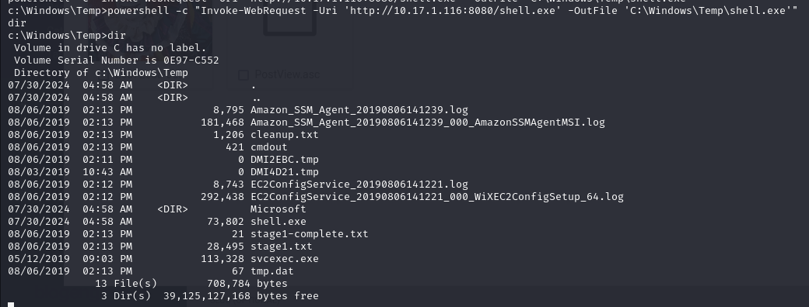
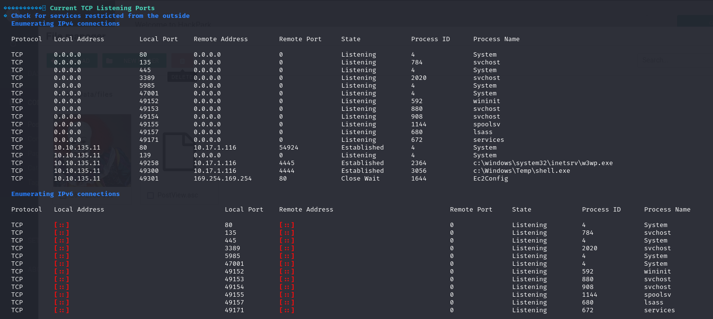

# Hack Park
- Scanning and Enumeration
  logseq.order-list-type:: number
	- `nmap` scan results
	  logseq.order-list-type:: number
		- Fast Scan
			- 
		- In-Depth Scan [run parallelly]
			- 
	- Brute-Force **admin** console login using `hydra`
	  logseq.order-list-type:: number
		- `burpsuite` - intercepted login request
			- 
		- 
- Initial Access
  logseq.order-list-type:: number
	- Server -> BlogEngine.NET,  version -> `3.3.6`
	  logseq.order-list-type:: number
		- Vulnerability - `CVE-2019-6714` https://nvd.nist.gov/vuln/detail/CVE-2019-6714
			- **description** - A path traversal and Local File Inclusion vulnerability in PostList.ascx.cs can cause unauthenticated users to load a PostView.ascx component from a potentially untrusted location on the local filesystem. <u>This is especially dangerous if an authenticated user uploads a PostView.ascx file using the file manager utility, which is currently allowed. This results in remote code execution for an authenticated user.</u>
		- Exploit - https://www.exploit-db.com/exploits/46353
		- On uploading the payload `ascx` script and navigating to `<ip>/?theme=../../App_Data/files` we get a reverse shell
			- 
			- 
			- 
	- To switch to a more stable shell [`meterpreter`]
	  logseq.order-list-type:: number
		- Navigate to a <u>universally writeable directory</u> 
		  logseq.order-list-type:: number
			- 
		- Generate payload
		  logseq.order-list-type:: number
			- 
		- Use `Invoke-WebRequest` to obtain `shell.exe`
		  logseq.order-list-type:: number
			- 
			- 
		- Configure a listener on `msfconsole` and execute the shell
		  logseq.order-list-type:: number
			- 
			- 
			- 
- Privilege Escalation
  logseq.order-list-type:: number
	- Obtain `winPEASx64` from the attack machine to enumerate **privesc** vectors
	  logseq.order-list-type:: number
		- 
		- {:height 114, :width 608}
	- Execute `winPEASx64`
	  logseq.order-list-type:: number
		- Users
		  logseq.order-list-type:: number
			- 
		- Env. variables
		  logseq.order-list-type:: number
			- 
			- 
		- Active TCP
		  logseq.order-list-type:: number
			- 
		- Services
		  logseq.order-list-type:: number
			- 
			- **possible vector** - `WindowsScheduler` is running and the folder in the execution path has Write/Create permissions
	- Navigate to the `SystemScheduler` directory and view the logs
	  logseq.order-list-type:: number
		- 
		- `Message.exe` is being executed by the scheduler with **root** permissions
	- Change the name of `Message.exe` and replace it with `shell.exe` [our `meterpreter` payload from earlier]
	  logseq.order-list-type:: number
		- 
		- 
	- Configure another `metasploit` listener to receive the connection
	  logseq.order-list-type:: number
		- 
- Flag Proof
  logseq.order-list-type:: number
	- User - 
	- Root - 
