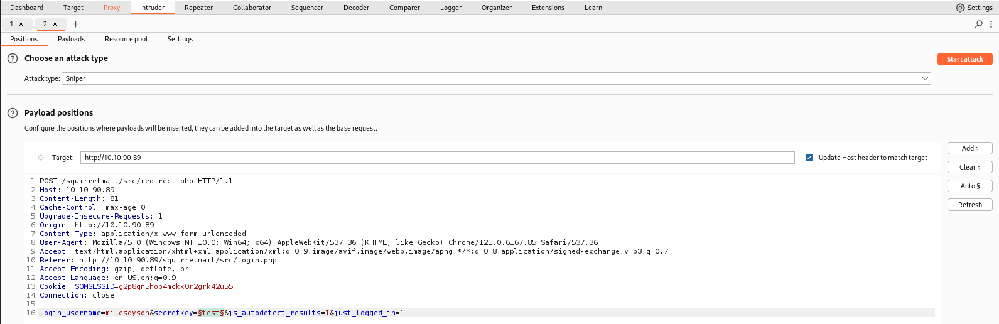
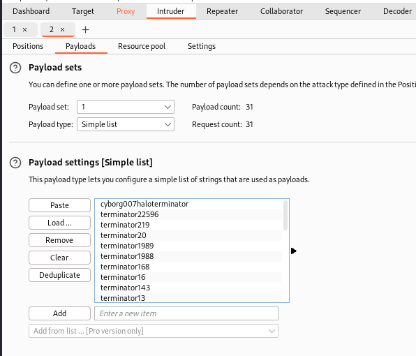
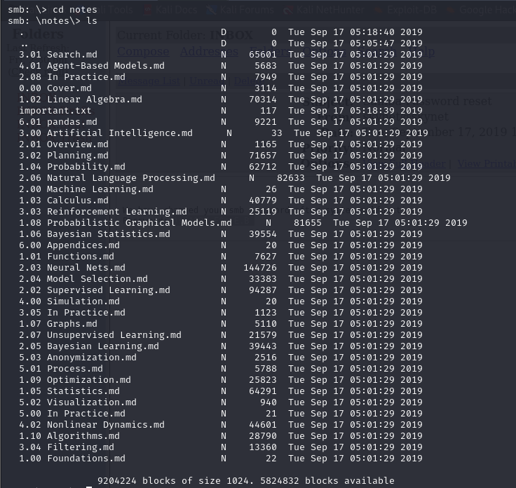
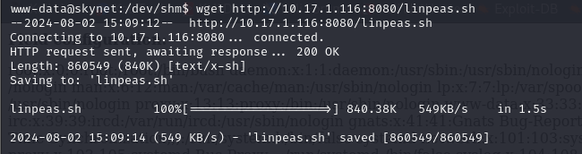
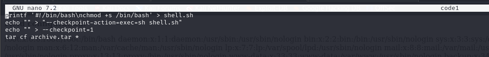
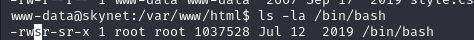

## Skynet CTF Report
- ### Scanning & Enumeration
	- **nmap**
		- Basic scan
			- 
		- Advanced scan
			- 
	- **gobuster** - root scan
		- 
		- `squirrelmail` directory login is found
	- **SMB Enumeration**
		- 
		- Note user - `milesdyson`
		- Try login using default `anonymous` credentials
			- 
			- Obtain `attention.txt` and `log1.txt` (Other log files are ignored as size=0)
			- 
			- Viewing the files we notice that the log file is a list of passwords
			- 
- ### Initial Access
	- Brute force `squirrelmail` login
		- 
		- **burpsuite**
			- Intercepted HTTP request
			- 
			- Send to intruder; mark password field as `payload position`
			- 
			- Load `log1.txt` as `sniper` payload
			- {:height 518, :width 596}
			- *Attack Results*
			- 
				- Since the first request's response size is different from all the other requests; we can assume it to be the password
			-
	- Access `smb` server using new found login for user `milesdyson`
		- 
		- 
		- 
		- `important.txt`
			- 
			- Hidden directory found
		-
		-
	- Run `gobuster` scan on the newly found hidden directory
		- 
		- `/administrator` - directory found
		- Cuppa CMS
			- {:height 440, :width 688}
			- Vulnerability
				- 
				- 
			- Exploit
				- 
		-
	- Exploit CMS
		- Exploiting `urlConfig` field - Make the server download and execute `php-reverse-shell.php`
		- 
		- 
		- **user flag**
			- 
		- **shell stabilization**
			- 
- ### Privilege Escalation
	- Use `wget` to load `linpeas.sh` onto the target system
		- {:height 180, :width 650}
	- `LinPeas.sh` -> `privesc` vectors (output)
		- 
		- 
		- 
		- 
		- 
		- 
		- 
	- Possible Vector - `backup.sh` is run as `root` every minute
		- 
		- 
	- Viewing `backup.sh` - we notice  tar command using a wildcard
		- 
		- directory listing
			- 
		- Using this article as a reference - https://www.hackingarticles.in/exploiting-wildcard-for-privilege-escalation
		- View `/bin/bash` binary owner
			- 
	- Objective - convert `/bin/bash` to a `SETUID` so that user `milesdyson` can execute with root permissions
		- This is done using the wildcard exploit for the `tar` command in `backup.sh`
			- **concept**
				- When the command `tar cf archive.tar *` is run in (`backup.sh`)the directory -`\\var\\www\\html`
					- the wildcard matches all the files in the directory and archives them
				- create a `.sh` file that changes the sets `/bin/bash` as an SETUID binary
					- `printf '#!/bin/bash\nchmod +s /bin/bash > shel.sh`
					- if this script is run normally; it won't work since it is run as `user-milesdyson`
				- the commands
					- **–checkpoint[=NUMBER] **show progress messages every Numbers record (default 10)
					- **–checkpoint-action=ACTION **execute ACTION on each checkpoint
					- There is a `–checkpoint-action option`, that will specify the program which will be executed when the checkpoint is reached. Mainly, this permits us to run an arbitrary command. Hence Options `–checkpoint=1` and `-checkpoint-action=exec=sh shell.sh` are handed to the `tar` program as command-line options.
					-
		- 
		- 
		- After the `backup.sh` script runs (runs every minute), we can check permissions on `/bin/bash`
			- 
		- The binary is successfully made an `SETUID` binary which means that the user `milesdyson` can execute the binary directly with elevated `root` user permissions
		- 
		- 
	- **root flag**
		- 
